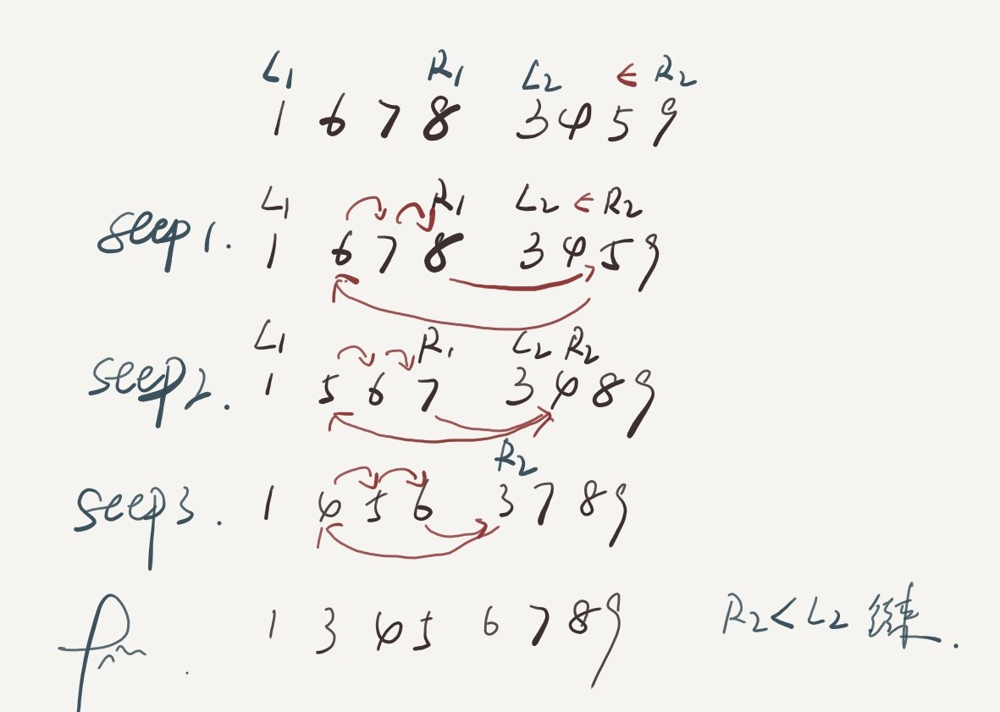
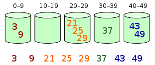

# 排序

## 分类

评价排序算法的几个指标：

* **时间复杂度**：包括平均时间复杂度、最坏时间复杂度和最好时间复杂度。一般而言，好的性能是$$O(nlog_2n)$$，坏的性能是$$O(n^2)$$。对于一个排序理想的性能是O(n)，但平均而言不可能达到。基于比较的排序算法对大多数输入而言至少需要$$O(nlog_2n)$$。
* **空间复杂度**：内存使用量
* **稳定性**： 稳定排序算法会让原本有相等键值的纪录维持相对次序。也就是如果一个排序算法是**稳定**的，当有两个相等键值的纪录**R**和**S**，且在原本的列表中**R**出现在**S**之前，在排序过的列表中**R**也将会是在**S**之前。
*  **依据排序的方法**：插入、交换、选择、合并等等。  

本文介绍了以下几种排序，推荐**可视化网站[visualgo]( https://visualgo.net/zh/sorting )**,下文代码都采用数组作为输入。

| 排序方法 | 平均时间复杂度 | 最坏时间复杂度 | 最好时间复杂度 |  空间复杂度   | 稳定性 |
| :------: | :------------: | :------------: | :------------: | :-----------: | :----: |
| 冒泡排序 |   $$O(n^2)$$   |   $$O(n^2)$$   |      O(n)      |     O(1)      |  稳定  |
| 选择排序 |   $$O(n^2)$$   |   $$O(n^2)$$   |   $$O(n^2)$$   |     O(1)      | 不稳定 |
| 插入排序 |   $$O(n^2)$$   |   $$O(n^2)$$   |      O(n)      |     O(1)      |  稳定  |
|  堆排序  | $$O(nlog_2n)$$ | $$O(nlog_2n)$$ | $$O(nlog_2n)$$ |     O(1)      | 不稳定 |
| 归并排序 | $$O(nlog_2n)$$ | $$O(nlog_2n)$$ | $$O(nlog_2n)$$ |     O(n)      |  稳定  |
| 快速排序 | $$O(nlog_2n)$$ |   $$O(n^2)$$   | $$O(nlog_2n)$$ | $$O(log_2n)$$ | 不稳定 |
| 希尔排序 | $$O(n^{1.3})$$ |   $$O(n^2)$$   |      O(n)      |     O(1)      | 不稳定 |
| 计数排序 |     O(n+m)     |     O(n+m)     |     O(n+m)     |    O(n+m)     |  稳定  |
| 基数排序 |     O(n*k)     |     O(n*k)     |     O(n*k)     |    O(n+k)     |  稳定  |
|  桶排序  |     O(n+k)     |   $$O(n^2)$$   |      O(n)      |    O(n+k)     |  稳定  |

* 均按从小到大排列 
* k代表数值中的"数字"个数
* n代表数据规模
* m代表数据的最大值减最小值

## 冒泡排序

数据分区：（无序区，有序区）。
从无序区透过交换找出最大元素放到有序区前端。 


### 流程

1. 比较相邻的元素。如果第一个比第二个大，就交换他们两个。
2. 对每一对相邻元素作同样的工作，从开始第一对到结尾的最后一对。这步做完后，最后的元素会是最大的数。
3. 针对所有的元素重复以上的步骤，除了最后一个。
4. 持续每次对越来越少的元素重复上面的步骤，直到没有任何一对数字需要比较。


### 代码

```python
def bubble_sorted(nums):
    size = len(nums)
    for i in range(size-1):
        for j in range(size-1-i):
            if nums[j] > nums[j+1]:
                nums[j],nums[j+1]=nums[j+1],nums[j]
    return nums
```

但是，该算法的最优时间复杂度[并不是O(n)，而是$$O(n^2)$$]( https://www.cnblogs.com/melon-h/archive/2012/09/20/2694941.html )。需改写才能实现最优理想状态：

```python
def bubble_sorted(nums):
    size = len(nums)
    for i in range(size-1):
        didSwap=False
        for j in range(size-1-i):
            if nums[j] > nums[j+1]:
                nums[j],nums[j+1]=nums[j+1],nums[j]
                didSwap=True
        if didSwap==False:
            return
    return nums
```

## 选择排序

数据分区：（有序区，无序区）。<br/>在无序区里找一个最小的元素跟在有序区的后面。对数组：比较得多，换得少。 

 

### 流程

1. 初始状态：无序区为R[1..n]，有序区为空；
2. 第i趟排序(i=1,2,3…n-1)开始时，当前有序区和无序区分别为R[1..i-1]和R(i..n）。该趟排序从当前无序区中-选出关键字最小的记录 R[k]，将它与无序区的第1个记录R交换，使R[1..i]和R[i+1..n)分别变为记录个数增加1个的新有序区和记录个数减少1个的新无序区；
3. n-1趟结束，数组有序化了。


### 代码

```python
def selection_sorted(nums):
    size = len(nums)
    for i in range(size-1):
        min_index = i
        for j in range(i, size):
            if nums[j] < nums[min_index]:
               min_index = j
        nums[i], nums[min_index] = nums[min_index], nums[i]
    return nums
```

## 插入排序

数据分区：（有序区，无序区）。<br/>把无序区的第一个元素插入到有序区的合适的位置。对数组：比较得少，换得多。 


### 流程

1. 从第一个元素开始，该元素可以认为已经被排序；
2. 取出下一个元素，在已经排序的元素序列中从后向前扫描；
3. 如果该元素（已排序）大于新元素，将该元素移到下一位置；
4. 重复步骤3，直到找到已排序的元素小于或者等于新元素的位置；
5. 将新元素插入到该位置后；
6. 重复步骤2~5。


### 代码

```python
def insertion_sorted(nums):
	size = len(nums)
	for i in range(1,size):
		cur_num=nums[i]
		pre_index=i-1
		while nums[pre_index]>cur_num and pre_index>=0:
			nums[pre_index+1]=nums[pre_index]
			pre_index-=1
		nums[pre_index+1]=cur_num
	return nums
```

## 堆排序

数据分区：（最大堆，有序区）。
从堆顶把根卸出来放在有序区之前，再恢复堆。 [关于堆](https://lil-q.github.io/2019/11/17/%E5%A0%86-heap/)


### 流程

1. 最大堆调整（Max Heapify）：将堆的末端子节点作调整，使得子节点永远小于父节点
2. 创建最大堆（Build Max Heap）：将堆中的所有数据重新排序
3. 堆排序（HeapSort）：移除位在第一个数据的根节点，并做最大堆调整的递归运算

### 代码

```python
def heap_sorted(nums):
    # 调整最大堆         
    def adjust_heap(idx, max_len):
        left = 2 * idx + 1
        right = 2 * idx + 2
        max_loc = idx
        if left < max_len and nums[max_loc] < nums[left]:
            max_loc = left
        if right < max_len and nums[max_loc] < nums[right]:
            max_loc = right
        if max_loc != idx:
            nums[idx], nums[max_loc] = nums[max_loc], nums[idx]
            adjust_heap(max_loc, max_len)  
    # 建堆
    n = len(nums)
    for i in range(n // 2 - 1, -1, -1):
        adjust_heap(i, n)
    # 排序
    for i in range(1, n):
        nums[0], nums[-i] = nums[-i], nums[0]
        adjust_heap(0, n - i)
    return nums
```

## 归并排序

把数据分为两段，从两段中逐个选最小的元素移入新数据段的末尾。
该算法是采用分治法（Divide and Conquer）的一个非常典型的应用。  


### 流程

1. 把长度为n的输入序列分成两个长度为n/2的子序列；
2. 对这两个子序列分别采用归并排序；
3. 将两个排序好的子序列合并成一个最终的排序序列。


### 代码

#### 递归法（Top-down）：

```python
def merge(left, right):
    result = []
    while left and right:
        if left[0] <= right[0]:
            result.append(left.pop(0))
        else:
            result.append(right.pop(0))
    if left:
        result += left
    if right:
        result += right
    return result

def merge_sort(L):
    if len(L) <= 1:
        return L
    mid = len(L) // 2
    left = L[:mid]
    right = L[mid:]
    left = merge_sort(left)
    right = merge_sort(right)
    return merge(left, right)
```

[时间复杂度是O(nlogn)，归并的空间复杂度为临时的数组和递归时压入栈的数据占用的空间：n + logn，所以空间复杂度为: O(n)]( https://blog.csdn.net/YuZhiHui_No1/article/details/44223225 ) 。

#### 迭代法（Bottom-up）

重写merge()，实现O(1)

```python
def merge_iter(nums,l1,l2,r2):
	r1=l2-1
	while r1>=l1 and r2>=l2:
		if nums[r1]>nums[r2]:
			tmp=nums[r2] # 暂存较小值
			nums[r2]=nums[r1]
			tmp_r1=r1-1
             # 将前半数组的大于tmp的值后移一个单位
			while nums[tmp_r1]>tmp and tmp_r1>=l1: 
				nums[tmp_r1+1]=nums[tmp_r1]
				tmp_r1-=1
			nums[tmp_r1+1]=tmp
		r2-=1
```

这里参考了[leetcode 88.合并两个有序数组]( https://leetcode-cn.com/problems/merge-sorted-array/solution/he-bing-liang-ge-you-xu-shu-zu-by-leetcode/ )，采用双指针从后往前合并两个有序数组（其实也就是一个数组切片的前一半和后一半），实现了空间复杂度O(1)。



**方法一：使用生成器**

```python
# 生成器产生2的幂
def powerOfTwo(max):
	x=1
	while x<=max:
		yield x
		x*=2
# 方法一：用生成器产生1，2，4，8...
def merge_sorted_iter(nums):
	sortedList=[]
	n=len(nums)
	for i in powerOfTwo(n):
	 	for j in range(0,n,i*2):
	 		merge_iter(nums,j,min(j+i,n-1),min(j+2*i-1,n-1))
	return nums
```

**方法二：使用位运算**

```python
# 方法二：用位操作产生1，2，4，8...
def msi(nums):
	length = len(nums)
	step = 1
    # 步长为1,2,4,8，...，一直合并下去
	while step <= length:
		offset = step << 1
		for index in range(0, length, offset):
			merge_iter(nums, index, min(index+step, length-1), min(index+offset-1, length-1))
		step = offset
```

[时间复杂度是$$O(nlog^2n)$$,空间复杂度为: O(1)](https://zh.wikipedia.org/wiki/排序算法 )。

## 快速排序

数据分区：（小数，基准元素，大数）。
在区间中随机挑选一个元素作基准，将小于基准的元素放在基准之前，大于基准的元素放在基准之后，再分别对小数区与大数区进行排序。 


### 流程

1. 从数列中挑出一个元素，称为 “基准”（pivot）；
2. 重新排序数列，所有元素比基准值小的摆放在基准前面，所有元素比基准值大的摆在基准的后面（相同的数可以到任一边）。在这个分区退出之后，该基准就处于数列的中间位置。这个称为分区（partition）操作；
3. 递归地（recursive）把小于基准值元素的子数列和大于基准值元素的子数列排序。


### 代码

```python
import random
def quick_sorted(nums):
    if len(nums) <= 1:
        return nums
    left, right, mid = [], [], []
    pivot = random.choice(nums)
    for num in nums:
        if num == pivot:
            mid.append(num)
        elif num < pivot:
            left.append(num)
        else:
            right.append(num)
    return quick_sorted(left) + mid + quick_sorted(right)
```

需要$${\Omega (n)}$$的额外存储空间，也就跟归并排序一样不好。额外需要的存储空间，在实际实现时，也会极度影响速度和缓存的性能 。下面是原地排序的代码， [平均可以达到$$O(\log n)$$的空间复杂度]( [https://zh.wikipedia.org/wiki/%E5%BF%AB%E9%80%9F%E6%8E%92%E5%BA%8F#Python%E5%8E%9F%E5%9C%B0%E6%8E%92%E5%BA%8F%E7%89%88%E6%9C%AC](https://zh.wikipedia.org/wiki/快速排序#Python原地排序版本) )。 

```python
def quick_sorted_inp(nums, first, last):
    if first >= last:
        return
    mid_value = nums[first]
    low = first
    high = last
    while low < high:
        while low < high and nums[high] >= mid_value:
            high -= 1
        nums[low] = nums[high]
        while low < high and nums[low] < mid_value:
            low += 1
        nums[high] = nums[low]
    nums[low] = mid_value
    quick_sorted_inp(nums, first, low-1)
    quick_sorted_inp(nums, low+1, last)
```

## 希尔排序

也称递减增量排序算法，是插入排序的一种更高效的改进版本。希尔排序是非稳定排序算法。

希尔排序是基于插入排序的以下两点性质而提出改进方法的：

> 1. 插入排序在对几乎已经排好序的数据操作时，效率高，即可以达到线性排序的效率
> 2. 但插入排序一般来说是低效的，因为插入排序每次只能将数据移动一位


### 流程

1. 选择一个增量序列$$t_1$$，$$t_2$$，…，$$t_k$$，其中$$t_i$$>$$t_j$$，$$t_k$$=1；
2. 按增量序列个数k，对序列进行k 趟排序；
3. 每趟排序，根据对应的增量$$t_i$$，将待排序列分割成若干长度为m 的子序列，分别对各子表进行直接插入排序。仅增量因子为1 时，整个序列作为一个表来处理，表长度即为整个序列的长度。

### 代码

```python
def shell_sorted(nums):
    n = len(nums)
    # 初始步長，理论上只要最终步长为1任何步长序列都可以工作
    gap = n // 2
    while gap > 0:
        for i in range(gap, n):
            # 每个步長進行插入排序
            temp = nums[i]
            j = i
            # 插入排序
            while j >= gap and nums[j - gap] > temp:
                nums[j] = nums[j - gap]
                j -= gap
            nums[j] = temp
        # 得到新的步長
        gap = gap // 2
    return nums
```

实际上使用1，2，4，8...的增量序列有时会在gap=1时浪费很多时间，[Mark Allen Weiss]指出，最好的增量序列是 Sedgewick提出的 (1, 5, 19, 41, 109,...)，该序列的项来自 9 * 4^i - 9 * 2^i + 1 和 4^i - 3 * 2^i + 1 这两个算式。[使用 Sedgewick增量 的希尔排序的完整C语言程序](https://blog.csdn.net/u013630349/article/details/48250109)

## 计数排序

计数排序不是基于比较的排序算法，其核心在于将输入的数据值转化为键存储在额外开辟的数组空间中。作为一种线性时间复杂度的排序，计数排序要求输入的数据必须是有确定范围的整数。

### 流程

1. 找出待排序的数组中最大和最小的元素；
2. 统计数组中每个值为i的元素出现的次数，存入数组C的第i项；
3. 对所有的计数累加（从C中的第一个元素开始，每一项和前一项相加）；
4. 反向填充目标数组：将每个元素i放在新数组的第C(i)项，每放一个元素就将C(i)减去1。


### 代码

```python
def counting_sorted(nums):
	# 计数排序针对非负整数，初始化最大值为-1，也可以设为nums[0]
    maxValue=-1
	for num in nums:
		if num>maxValue:
			maxValue=num
	bucket = [0]*(maxValue+1)
	for num in nums:
		bucket[num]+=1
	index=0
	for i in range(len(bucket)):
		while bucket[i]>0:
			nums[index] = i
			index+=1
			bucket[i]-=1
	return nums
```

## 基数排序

基数排序是按照低位先排序，然后收集；再按照高位排序，然后再收集；依次类推，直到最高位。有时候有些属性是有优先级顺序的，先按低优先级排序，再按高优先级排序。最后的次序就是高优先级高的在前，高优先级相同的低优先级高的在前。

### 流程

1. 取得数组中的最大数，并取得位数；
2. 从最低位开始取每个位组成radix数组；
3. 对radix进行计数排序（利用计数排序适用于小范围数的特点）；


### 代码

```python
def radix_sorted(nums):
	# 基数排序针对非负整数，初始化最大值为-1,也可以设为nums[0]
    maxValue=-1
	for num in nums:
		if num>maxValue:
			maxValue=num 
	# 求最高位数n
	n=len(str(maxValue))
	# 进行n次排序
	for k in range(n):       
		s=[[] for i in range(10)]
		for i in nums:
			s[i//(10**k)%10].append(i)
		nums=[a for b in s for a in b]
	return nums
```

## 桶排序

桶排序是计数排序的升级版。它利用了函数的映射关系，高效与否的关键就在于这个映射函数的确定。桶排序 (Bucket sort)的工作的原理：假设输入数据服从均匀分布，将数据分到有限数量的桶里，每个桶再分别排序（有可能再使用别的排序算法或是以递归方式继续使用桶排序进行排）。

### 流程

1. 设置一个定量的数组当作空桶；
2. 遍历输入数据，并且把数据一个一个放到对应的桶里去；
3. 对每个不是空的桶进行排序；
4. 从不是空的桶里把排好序的数据拼接起来。




### 代码

```python
def bucket_sorted(nums):
	if not nums:return nums
	maxValue=nums[0]
	minValue=nums[0]
	for num in nums:
		if num>maxValue:
			maxValue=num 
		elif num<minValue:
			minValue=num
	# 将数据映射到桶中
	bucketSize=100 # 设定桶的大小
	bucketCount=(maxValue-minValue)//bucketSize+1 # 计算桶的数量
	buckets=[[] for _ in range(bucketCount)]
	for num in nums:
		buckets[(num-minValue)//bucketSize].append(num)
	# 对桶内排序，这里使用插入排序，也可以递归桶排序。
	res=[]
	for k in buckets:       
		res=res+insertion_sorted(k)
	return res
# 插入排序
def insertion_sorted(nums):
	size = len(nums)
	for i in range(1,size):
		cur_num=nums[i]
		pre_index=i-1

		while nums[pre_index]>cur_num and pre_index>=0:
			nums[pre_index+1]=nums[pre_index]
			pre_index-=1
		nums[pre_index+1]=cur_num
	return nums
```

## 总结

桶排序、基数排序和计数排序都属于非比较类排序，其中计数排序和基数排序都用到了桶排序的思想。计数排序一共分了0，1，2...maxValue一共maxValue+1个桶，每个桶表示一个数；而基数排序则分了十个桶，从第一位开始递归桶排序。冒泡排序，选择排序，插入排序都是比较两个数然后交换。堆排序，归并排序，快速排序则是运用了分治的思想。


## 参考

1.  [https://zh.wikipedia.org/wiki/%E6%8E%92%E5%BA%8F%E7%AE%97%E6%B3%95](https://zh.wikipedia.org/wiki/排序算法) 
2.  [https://github.com/amusi/Deep-Learning-Interview-Book/blob/master/docs/%E6%95%B0%E6%8D%AE%E7%BB%93%E6%9E%84%E4%B8%8E%E7%AE%97%E6%B3%95.md](https://github.com/amusi/Deep-Learning-Interview-Book/blob/master/docs/数据结构与算法.md) 
3.  https://www.cnblogs.com/onepixel/p/7674659.html 